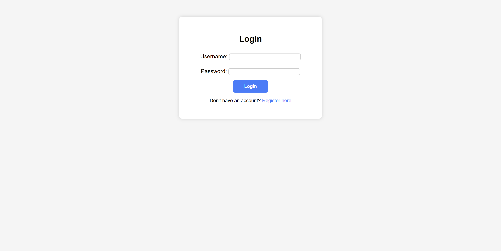
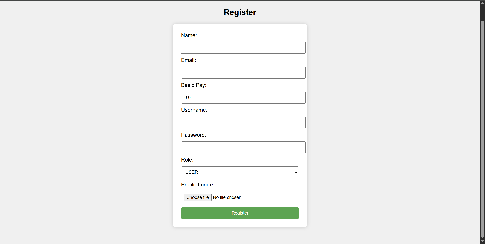
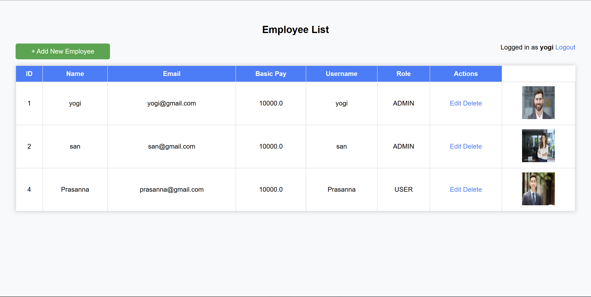
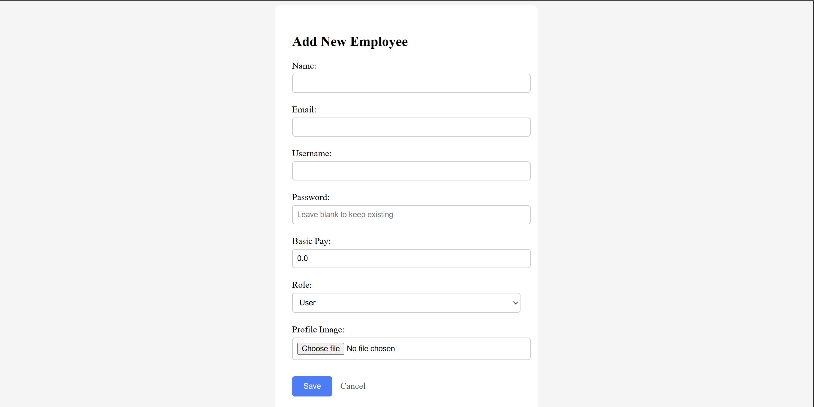

# Employee Management System – Frontend

A Spring Boot–based Employee Management frontend application that provides
secure authentication, employee CRUD operations, and role-based access using
Spring Security and Thymeleaf.

This project is designed as a simple HR-style system to manage employee records
through a clean and secure web interface.

---

## 🚀 Features

- User registration and login
- Role-based authentication (Admin / User)
- Add, update, view, and delete employees
- Secure login using Spring Security
- Thymeleaf-based UI templates
- Employee profile image upload support

---

## 🛠️ Tech Stack

- **Backend:** Spring Boot, Spring MVC
- **Security:** Spring Security
- **Frontend:** Thymeleaf, HTML, CSS
- **Database:** MySQL / H2 (configurable)
- **Build Tool:** Maven
- **Java Version:** Java 17+

---

<pre>
EmployeeFrontend/
├── src/main/java
│   ├── controller
│   ├── service
│   ├── repository
│   ├── model
│   └── security
├── src/main/resources
│   ├── templates
│   └── application.properties
├── employee-photos
├── screenshots
├── pom.xml
└── README.md
</pre>


## 🔐 Authentication

- Login page for registered users
- Role-based access control
- Admin users can manage employees
- Normal users have limited access

---

## 📸 Screenshots

### 🔑 Login Page


### 📝 Registration Page


### 👥 Employee List


### ➕ Add Employee



---

## ▶️ How to Run the Project

1. Clone the repository
   ```bash
   git clone https://github.com/mkyogesh/Employee-Frontend.git

2. Configure database in application.properties

spring.application.name=EmployeeFrontend
spring.datasource.url=jdbc:mysql://localhost:3306/sample
spring.datasource.username=root
spring.datasource.password=root
spring.datasource.driver-class-name=com.mysql.cj.jdbc.Driver

spring.jpa.hibernate.ddl-auto=update
spring.jpa.show-sql=true
spring.servlet.multipart.max-file-size=10MB
spring.servlet.multipart.max-request-size=10MB

3. Run the application

mvn spring-boot:run 

4. Open in browser

http://localhost:8080